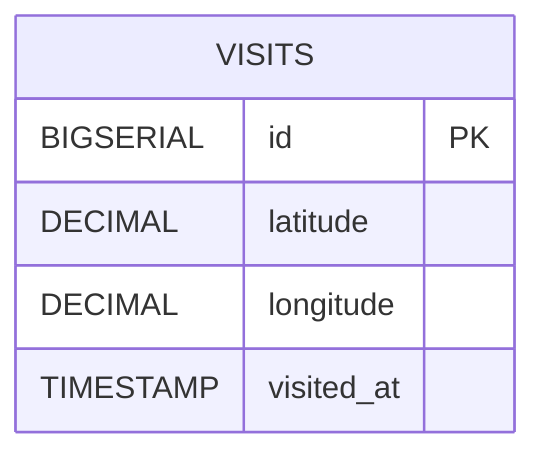

## 기능 명세서
* 프로젝트 개요

* 주요 기능
  | 번호 | 기능명 | 설명 | 우선순위 |
  | --- | --- | --- | --- |
  | F1 | 초기 위치 수집 | 브라우저 Geolocation API를 통해 최초 위치(위도, 경도)를 가져와 저장(`localStorage`) | 최고 |
  | F2 | 자동 방문 처리 | 초기 위치로부터 1km 이내 위치가 5초 간격으로 3회 연속 확인되면 백엔드에 방문 기록 자동 생성 | 높음 |
  | F3 | 수동 방문 처리 | 사용자가 “방문 처리” 버튼을 클릭하면 백엔드에 방문 기록 생성 | 높음 |
  | F4 | 방문 기록 저장 | 백엔드(`POST /api/visits`)를 통해 방문 기록(위도, 경도, 타임스탬프)을 DB에 저장 | 최고 |
  | F5 | 방문 기록 조회 | 사용자가 방문 기록 목록 조회 시, 백엔드(`GET /api/visits`)에서 모든 기록을 불러와 화면에 표시 | 보통 |
  | F6 | 방문 기록 시각화 (지도) | 저장된 방문 기록의 위도‧경도를 지도(Leaflet 등)에 마커로 표시 | 선택 |
  | F7 | CORS 처리 | 프론트(React)와 백엔드(Spring Boot) 간 CORS 이슈 해결 설정 | 필수 |
  | F8 | 에러/로딩 처리 UI | API 호출 시 로딩 스피너 및 에러 메시지 표시 | 필수 |
  | F9 | PWA 매니페스트/서비스 워커 | offline 지원, 푸시 알림, 매니페스트 설정 | 선택 |

## 테이블 정의서

* 테이블: `Visits`

  | 컬럼명 | 데이터 타입 | 제약조건 | 설명 |
  | --- | --- | --- | --- |
  | id | BIGSERIAL | PRIMARY KEY | 방문 기록 고유 식별자 |
  | latitude | DECIMAL(9,6) | NOT NULL | 방문 시 위도 |
  | longitude | DECIMAL(9,6) | NOT NULL | 방문 시 경도 |
  | visited_at | TIMESTAMP WITH TIME ZONE | NOT NULL DEFAULT now() | 방문 처리(자동/수동) 시각 |

  ```sql
  CREATE TABLE visits (
    id BIGSERIAL PRIMARY KEY,
    latitude DECIMAL(9,6) NOT NULL,
    longitude DECIMAL(9,6) NOT NULL,
    visited_at TIMESTAMP WITH TIME ZONE NOT NULL DEFAULT now()
  );
  ```

## ERD



## 개발 표준 정의서

* 브랜치 네이밍

  - 기능 개발: `feature/<short-description>` (예: `feature/api-integration`)
  - 버그 수정: `fix/<short-description>` (예: `fix/cors-error`)
  - 리팩토링: `refactor/<short-description>` (예: `refactor/landing-page`)

* 커밋 메시지

  - **형식**: `<type>(<scope>): <subject>`
      - type: `feat`, `fix`, `refactor`, `docs`, `test`, `chore`
      - scope: 모듈 또는 기능 이름
      - subject: 50자 이내 간결한 설명
  - **예시**: `feat(api): 방문 API 연동 및 자동 처리 로직 구현`

* 코드 스타일

  - **JavaScript/TypeScript**
      - ESLint + Prettier 자동 포맷 적용
      - airbnb 스타일 가이드 기반 룰 사용
      - arrow function 사용 권장
  - **Java (Spring Boot)**
      - Google Java Style Guide 준수
      - Lombok 사용 시 `@Builder`, `@Data` 등 활용

* API 설계

  - **RESTful** 패턴 준수
  - 엔드포인트 명명: 복수형 명사 사용 (`/api/visits`)
  - HTTP 메서드: GET(조회), POST(생성), PUT/PATCH(수정), DELETE(삭제)
  - 요청/응답 바디: JSON 포맷, 날짜는 ISO 8601

* 테스트
  - **단위 테스트**: Jest + React Testing Library (frontend), JUnit + Spring Test (backend)
  - **테스트 커버리지**: 최소 80% 이상 목표
  - CI 환경에서 자동 실행

* 문서화
  - **API 문서**: OpenAPI 3.0 (springdoc-openapi) 자동 생성 및 Swagger UI 제공
  - **프로젝트 README**: 프로젝트 개요, 실행 방법, 환경 변수 설명 포함

## 아키텍처


